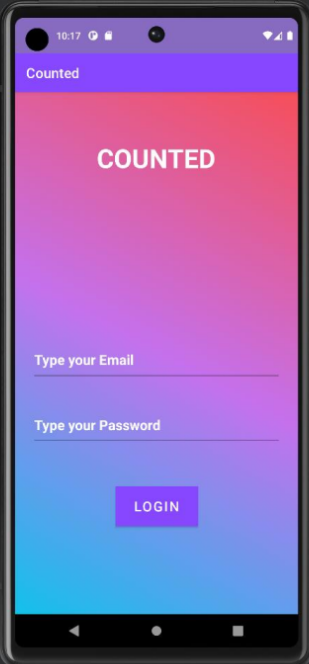
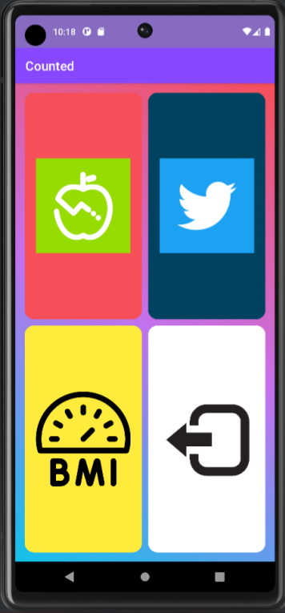
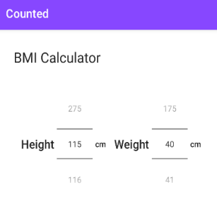

# Project
Counted provides a concise and user-friendly mobile solution that enables newcomers to plan, track and evaluate precise nutritional data with a specific pre-determined fitness goal. 
Precise nutritional datat is defined by the per-serving information for any item of food, listed as Energy, Protein, Fats and Carbs.

# Login Page

Initial screen asking for user email and case sensitive password. Firebase authenticated.  &nbsp;  
&nbsp;  
 &nbsp;     

# Navigation
Main page for accessing the app. Grid menu takes users to BMI Calculator, Social Media, Diary, and Logout feature. &nbsp;  
&nbsp;  
 &nbsp;   

# BMI Calculator
 &nbsp;  
&nbsp;  
 &nbsp;   

##  Description

Android application created using the following:

* Android Studio
* Kotlin
* Java
* Firebase
* Git
* API

##  Key features

* Diet Diary for calendar-based record keeping
* Social media feed for app updates
* BMI calculator
* User authentication 
  
